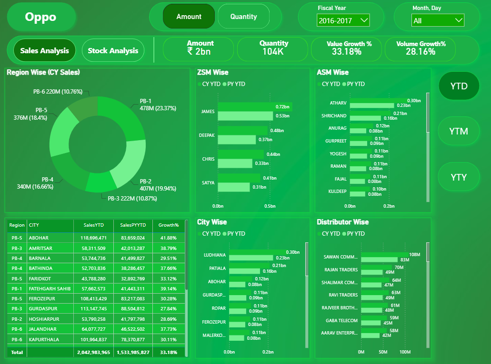
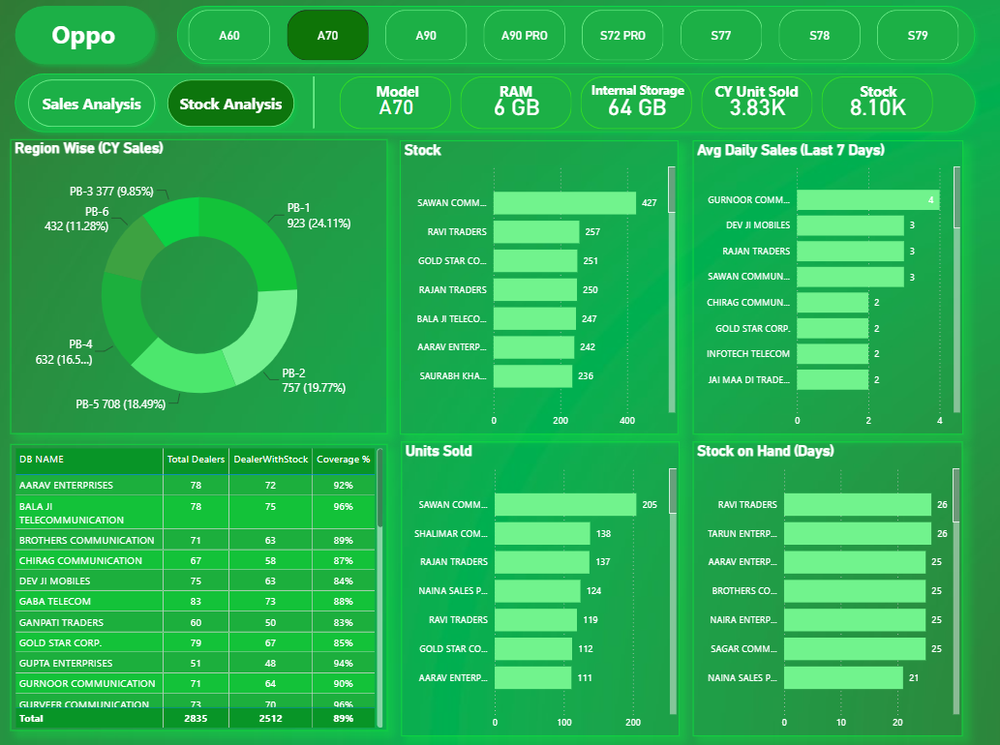

# OPPO Sales & Stock Analytics Dashboard

## Project Overview

This Power BI project was developed for OPPO, a global smartphone manufacturer known for its innovative mobile devices and extensive distribution network. The dashboard provides a comprehensive view of sales performance and inventory management, enabling stakeholders to make data-driven decisions across regions, cities, and distributors.

## Business Problem

Managing sales performance and inventory across multiple regions and distributors can be challenging when data is scattered across different reports and systems. Business leaders needed a centralized solution to:

* Monitor sales performance across regions and distributors.
* Compare current year sales against previous year performance.
* Track inventory availability by mobile model.
* Identify stock shortages and excess inventory.
* Support data-driven sales and inventory planning.

## Solution

Designed and developed an interactive Power BI dashboard consisting of two analytical pages:

### 1. Sales Analysis Dashboard

Provides detailed insights into sales performance across multiple organizational levels.

**Key Features:**

* Region-wise sales analysis
* ZSM and ASM performance comparison
* City-wise sales tracking
* Distributor-wise performance analysis
* Current Year vs Previous Year comparison
* YTD (Year-to-Date) sales analysis
* Growth percentage tracking
* Interactive filters and drill-down capabilities

### 2. Stock Analysis Dashboard

Offers complete visibility into inventory levels and stock movement.

**Key Features:**

* Distributor-wise stock monitoring
* Model-wise inventory tracking
* Average Daily Sales (ADS) analysis
* Days of Inventory calculation
* Dealer coverage analysis
* Stock availability monitoring
* Inventory planning support

## Dashboard Screenshots

### Sales Analysis Dashboard



### Stock Analysis Dashboard



## Key Business Metrics

### Sales Metrics

* Current Year Sales
* Last Year Sales
* Year-to-Date (YTD) Sales
* Growth Percentage
* Distributor Sales
* Region Performance

### Inventory Metrics

* Available Stock
* Model-wise Inventory
* Average Daily Sales (ADS)
* Days of Stock Coverage
* Dealer Coverage
* Distributor Stock Levels

## Tools & Technologies

* Power BI
* DAX (Data Analysis Expressions)
* Power Query
* Data Modeling
* Microsoft Excel
* Data Visualization
* Business Intelligence Reporting

## Business Impact

The dashboard enables stakeholders to:

* Identify high-performing and underperforming regions.
* Monitor distributor sales trends.
* Optimize inventory allocation.
* Reduce stock shortages and overstock situations.
* Improve sales planning and forecasting.
* Make faster, data-driven business decisions.

## Skills Demonstrated

* Power BI Dashboard Development
* Data Modeling
* DAX Calculations
* Data Transformation
* Sales Analytics
* Inventory Analytics
* KPI Design
* Business Intelligence
* Data Visualization
* Stakeholder Reporting

## Project Structure

```text
oppo-sales-stock-analysis-powerbi/
│
├── README.md
├── Screenshots/
│   ├── Sales_Dashboard.png
│   └── Stock_Dashboard.png
│
├── Dataset/
│   └── Sample_Data.xlsx
│
└── PowerBI/
    └── Oppo_Sales_Stock_Analysis.pbix
```

## Author

**Maninder Karda**

Senior Data Analyst | Power BI Developer

Specialized in transforming complex business data into actionable insights through interactive dashboards and analytics solutions.
